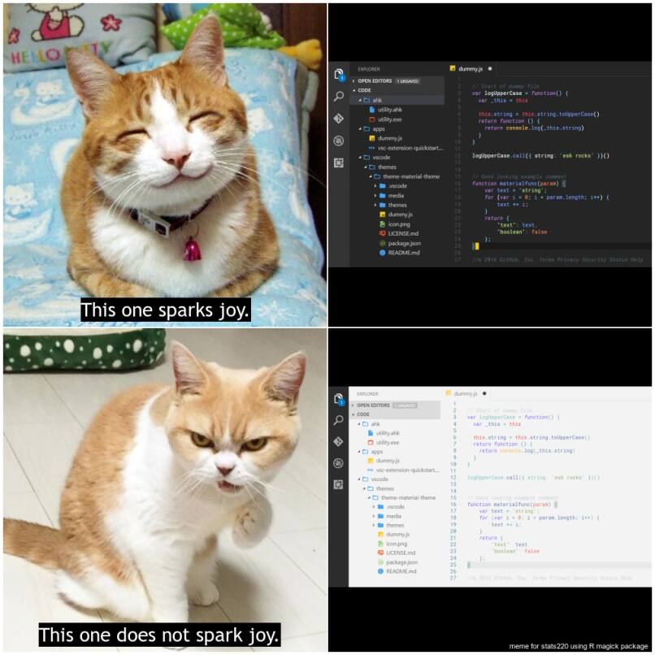

# Hello and welcome! :smile:
*Here is a meme I created* :smile_cat:


## Some info about my meme!
#### Why did I create this meme? :thinking:
1. I like cats and think they're pretty cool.
2. I prefer using dark mode interface - it's night owl friendly :D 
3. Did I mention that I like cats?
4. It's for an assignment. :smirk_cat:

I was inspired by the meme, [Does It Spark Joy?](https://meme-creator.com/meme/65662971/does-it-spark-joy) The popularised catchphrase refers to Japanese author and tidying consultant Marie Kondo and her Netflix series, [Tidying Up with Marie Kondo.](https://www.netflix.com/title/80209379) I kept the original catchphrase but replaced the images with cat reactions to show that dark mode ***sparks joy.***
#### What did I use to create this meme?
- I created this meme using an **R** package called [***magick***](https://cran.r-project.org/web/packages/magick/vignettes/intro.html)
- [Happy cat I found on the internet](https://i.imgflip.com/10xoy6.jpg)
- [Koyuki, the *grumpy* Scottish fold](https://abcnews.go.com/Lifestyle/japanese-grumpy-cat-fiercest-feline/story?id=37005279)
- [Dark mode image](https://www.tabnine.com/blog/wp-content/uploads/2021/11/16-light-1.png)
- [Light mode image](https://www.tabnine.com/blog/wp-content/uploads/2021/11/16-light-1.png)

*Here is the `R` code used to create this meme*
```
# cat spark joy

library(magick)

# happy cat square
happy_cat <- image_read("https://i.imgflip.com/10xoy6.jpg") %>%
  image_scale("x500") %>%
  image_crop("500x500+50") %>%
  image_annotate("This one sparks joy.",
                 color = "white",
                 boxcolor = "black",
                 size = 30,
                 font = "Trebuchet",
                 location = "+120+455") %>%
  image_border(color = "white", geometry = "1x1")

# angry cat square
angry_cat <- image_read("https://s.abcnews.com/images/Lifestyle/HT_grumpy_cat_02_as_float_160217_4x3t_608.jpg") %>%
  image_scale("x550") %>%
  image_crop("500x500+175") %>%
  image_annotate("This one does not spark joy.",
                 color = "white",
                 boxcolor = "black",
                 size = 30,
                 font = "Trebuchet",
                 location = "+55+455") %>%
  image_border(color = "white", geometry = "1x1")

# dark mode square
dark_mode <- image_blank(width = 500, height = 500, color = "black") %>%
  image_composite(image_read("https://www.tabnine.com/blog/wp-content/uploads/2021/11/16-dark.png") %>%
                  image_scale(500), offset = "+0+90") %>%                 
  image_border(color = "white", geometry = "1x1")

# light mode square
light_mode <- image_blank(width = 500, height = 500, color = "black") %>%
  image_composite(image_read("https://www.tabnine.com/blog/wp-content/uploads/2021/11/16-light-1.png") %>%
                  image_scale(500), offset = "+0+90") %>%
  image_annotate("meme for stats220 using R magick package",
                 color = "white", size = 11, location = "+280+485") %>%
  image_border(color = "white", geometry = "1x1")

cats <- image_append(c(happy_cat, angry_cat), stack = TRUE)
modes <- image_append(c(dark_mode, light_mode), stack = TRUE)

meme <- c(cats, modes) %>%
  image_append() %>%
  image_scale(800) %>%
  image_border(color = "white", geometry = "3x3")

image_write(meme, "my_meme.png")
```
